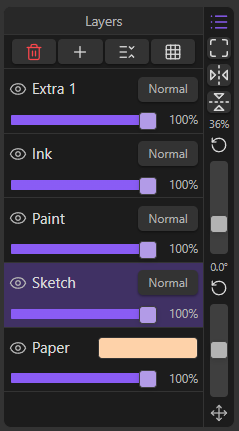
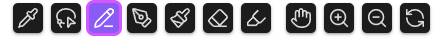
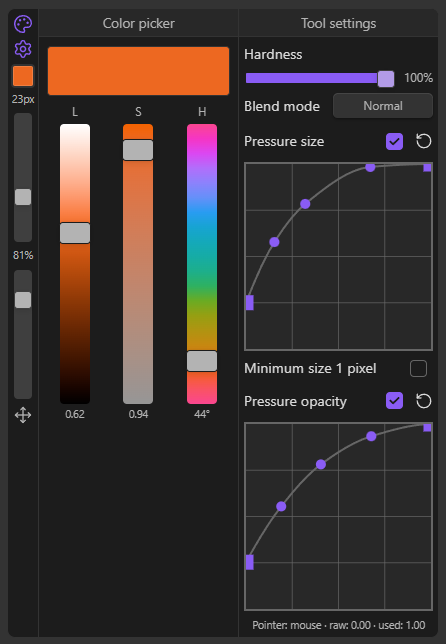

# Sketchpad

A raster drawing plugin for [Obsidian MD](https://obsidian.md/) that aims to emulate the typical digital drawing experience with inspiration from traditional sketching.

# Quick Start
1. Install the plugin from the [Obsidian's Community page](https://community.obsidian.md/plugins/sketchpad) and enable it.
2. Click the Sketchpad ribbon icon on the left sidebar to open a Sketchpad tab.
3. Click the `New...` button on the header to create a sketch file and start drawing.

# Usage
Draw on a sketch file with 4 base layers with optional extra layers. Each layer is associated with its own drawing tool. If you pick a drawing tool, the layer linked with it automatically becomes active and vice versa.
The layers and their associated tools are as follow:
- Paint layer - brush tool.
- Ink layer - pen tool.
- Sketch layer - pencil tool.
- Extra layers - marker tool.
- Paper layer - bottom layer, can't be drawn on. Paper color is customizable.

> [!IMPORTANT]
> The marker tool can draw on any layer (except for paper), not just the extra layers.

## Layer settings

*Layer action buttons from left to right: Delete layer, Add layer, Toggle layer reordering buttons, Toggle grid overlay*

- **Blending mode**: Normal, Multiply (except for paper layer)
- **Layer opacity slider**
- **Visibility toggle**
- **Adding layers**: up to 6 extra layers can be added.
- **Deleting layers**: only the extra layers can be deleted.

A grid overlay can be toggled on or off. The size, color, and opacity of the grid is customizable in the plugins's settings.

The layers can be reordered except for the Paper layer which always remains at the bottom of the stack.

## Drawing tool settings

*Tools from left to right: Eyedropper, Lasso, Pencil, Pen, Brush, Eraser, Marker, Hand tool, Zoom in tool, Zoom out tool, Rotate tool*

- **Color**: pick from a color picker that uses the [Okhsl color space by Björn Ottosson](https://bottosson.github.io/posts/colorpicker/).
- **Size slider**: 1-200 pixels
    - With optional custom pressure curve.
- **Opacity slider**
    - With optional custom pressure curve.
- **Hardness slider**
- **Blending Mode**: Normal, Replace Alpha, Compare Density
- **Optional**: hide cursor when drawing. Cursor remains visible when hovering.

> [!IMPORTANT]
> Enable `Windows Ink` to have pressure sensitivity on Windows devices.

## Other tools
- **Eraser**: erase on the layer of the last active tool.
- **Eyedropper**: select color for the last active tool.
- **Lasso**: freehand select an area to modify it.
    - Rotate the selection by dragging the rotate handle.
    - Resize the selection by dragging the dragging the square handles in the middle of the edges.
    - Proportionally resize the selection by dragging the square handles on the corners.
- **Hand tool**: click and drag to pan the canvas.
- **Zoom in/out tool**: click to zoom once, click and drag left/right to zoom out/in.
    - You can also zoom by scroll wheel.
- **Rotate tool**: click and drag to rotate the canvas.

## Features
- Create and draw on `.ora` files, an open file format for graphics editors created by [OpenRaster](https://www.openraster.org/). 
    - Files created by this plugin can be opened by any application that supports `.ora` files such as Krita. 
    - Each layer is a png image that can be accessed by simply unzipping the `.ora` file.

- Supports undo/redo up to 50 counts.
- Supports autosave in 5-30 minutes interval.
- Supports pointer/stroke prediction.
- Supports touch controls.
    - One-finger touch to pan.
    - Two-finger pinch to rotate, zoom, and pan.
    - Two-finger tap to undo.
    - Three-finger tap to redo.

> [!IMPORTANT]
> Enabling `Touch to draw` in the settings will make the one-finger gesture draw instead of panning the canvas. All other touch gestures remain the same.

- Supports importing images from Obsidian vault into the layers of a sketch document.
    - All image formats that Obsidian can rasterize can be imported. 
    - Currently supports: `.avif`, `.bmp`, `.gif`, `.jpeg`, `.jpg`, `.png`, `.svg`, `.webp`
    - Imported images are treated similarly to selections from the lasso tool and can be moved, resized, rotated before being baked to the target layer.

- Export any sketch file as a png image.
- Embed sketch files in notes with Wikilinks.
- Set custom keyboard shortcuts for tools and actions in Obsidian's hotkeys settings and the plugin's settings page.
- UI can be set to minimal or expanded.
- Left and right sidebars can be minimized and they can be moved in minimal UI mode.

## Default Hotkeys

| Tool          | Default Hotkey |
| ------------- | -------------- |
| Pencil        | P              |
| Pen           | N              |
| Brush         | B              |
| Marker        | M              |
| Eraser        | E              |
| Hand tool     | Space          |
| Lasso         | C              |
| Rotate tool   | R              |
| Zoom in tool  | Shift          |
| Zoom out tool | Control        |
| Eyedropper    | Alt            |

| Action                   | Default Hotkey   |
| ------------------------ | ---------------- |
| Open Sketchpad           |                  |
| Zoom in                  | Mouse Wheel Up   |
| Zoom out                 | Mouse Wheel Down |
| Rotate counter-clockwise | A                |
| Rotate clockwise         | S                |
| Decrease tool size       | D                |
| Increase tool size       | F                |
| Undo                     |                  |
| Redo                     |                  |
| New sketch file          |                  |
| Open sketch file         |                  |
| Save sketch file         |                  |
| Close sketch file        |                  |
| Fit sketch to view       |                  |
| Flip canvas horizontally |                  |
| Flip canvas vertically   |                  |

